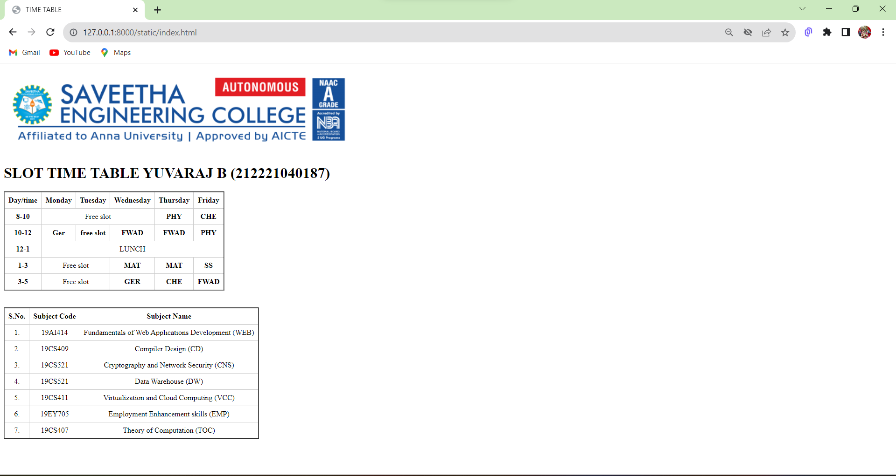

# Ex03 Time Table
## Date:13/09/2023


## AIM
To write a html webpage page to display your slot timetable.

## ALGORITHM
### STEP 1
Create a Django-admin Interface.

### STEP 2
Create a static folder and inert HTML code.

### STEP 3
Create a simple table using ```<table>``` tag in html.

### STEP 4
Add header row using ```<th>``` tag.

### STEP 5
Add your timetable using ```<td>``` tag.

### STEP 6
Execute the program using runserver command.

## CODE
```
<!DOCTYPE html>

<html>
    <head>

        <title> TIME TABLE </title>
        <style>
            table{
                width:50;
                border-collapse: collapse;
            }
            th,td{
                border: 1px solid #ccc;
                padding: 8px;
                text-align: center;
            }
        </style>
    </head>
    <body>
        <h1>SLOT TIME TABLE PREMJI P (212221043004)</h1>
        <table border="2" class table="table1">
            <tr>
                <th>Day/time</th>
                <th>Monday</th>
                <th>Tuesday</th>
                <th>Wednesday</th>
                <th>Thursday</th>
                <th>Friday</th>
            </tr>
            <tr>
                <th>8-10</th>
                <td colspan ="3">Free slot</td>
                <th>PHY</th>
                <th>CHE</th>    
            </tr>
            <tr>
                <th>10-12</th>
                <th>Ger</th>
                <th>free slot</th>
                <th>FWAD</th>
                <th>FWAD</th>
                <th>PHY</th>
            </tr>
            <tr>
                <th>12-1</th>
                <td colspan ="5">LUNCH</td>
            </tr>
            <tr>
                <th>1-3</th>
                <td colspan="2">Free slot</td>
                <th>MAT</th>
                <th>MAT</th>
                <th>SS</th>
            </tr>
            <tr>
                <th>3-5</th>
                <td colspan="2">Free slot</td>
                <th>GER</th>
                <th>CHE</th>
                <th>FWAD</th>
            </tr>
        </table>
        <br>
        </br>
        <table border="2" class="table2">
            <tr>
                <th>S.No.</th>
                <th>Subject Code</th>
                <th>Subject Name</th>
            </tr>
            <tr>
                <td>1.</td>
                <td>19AI414</td>
                <td>Fundamentals of Web Applications Development (WEB)</td>
            </tr>
            <tr>
                <td>2.</td>
                <td>19CS409</td>
                <td>Compiler Design (CD)</td>
            </tr>
            <tr>
                <td>3.</td>
                <td>19CS521</td>
                <td>Cryptography and Network Security (CNS)</td>
            </tr>
            <tr>
                <td>4.</td>
                <td>19CS521</td>
                <td>Data Warehouse (DW)</td>
            </tr>
            <tr>
                <td>5.</td>
                <td>19CS411</td>
                <td>Virtualization and Cloud Computing (VCC)</td>
            </tr>
            <tr>
                <td>6.</td>
                <td>19EY705</td>
                <td>Employment Enhancement skills (EMP)</td>
            </tr>
            <tr>
                <td>7.</td>
                <td>19CS407</td>
                <td>Theory of Computation (TOC)</td>
            </tr>
        </table>    
    </body>
</html>
```


## OUTPUT



## RESULT
The program for creating slot timetable using basic HTML tags is executed successfully.
